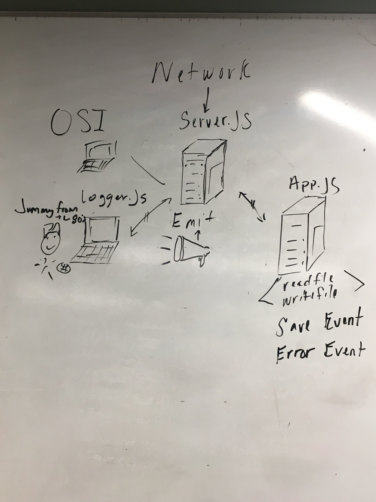

# LAB - 17

# Socket.io

### Authors: Pratiibh Bassi, Jeremy Lee

### Links and Resources
* [submission PR](https://github.com/pratiibh-401-advanced-javascript/lab-18/pull/1)
* [travis](travis link)

### Modules
#### `app.js`
#### `server.js`
#### `logger.js`
#### `app-test.js`
#### `test.txt`

#### Exported Values and Methods

##### `fs.read(file) -> string`
.toUppercase()

##### `fs.write(file) -> string`
Usage Notes or examples

### Setup
#### `.env` requirements
* `PORT` - 3001

#### Running the app 
##### (must be done in this order)
* `node server.js`
* `node logger.js`
* `node app.js ./files/test.txt`

  
#### Tests
* How do you run tests?
* What assertions were made?
* What assertions need to be / should be made?

#### UML

